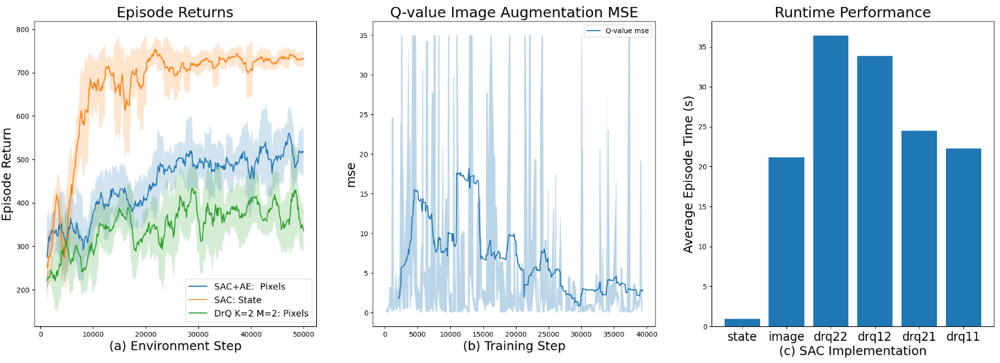

# DrQ

---

This is a repository to test the reproduction of the 2021 ICLR paper [Image Augmentation Is All You Need: Regularizing Deep Reinforcement Learning from Pixels](https://arxiv.org/abs/2004.13649).

The Regularized deep reinforcement learning method coined DrQ is tested with both continuous and discrete environments with SAC and DQN algorithms. The environments used are the deepmind control suite and atari gym with the results shown below. Read our **report** featured in the repo to find out more.


### Soft Actor Critic Results

---




### DQN Results 

---


## Using the Repository 

---

To recreate the results and run the code you will require a Nvidia Graphics Card with cuda-tookit>=11.

### SAC

---

**To install the required packages.** 

```
conda create --name env_name
conda activate env_name 

conda install python==3.9
pip install -r requirements.txt
```

**To run the SAC Algorithms from the terminal**
```python
# SAC Standard implmenetation on state observations
python src/SAC/state/train_agent.py

# SAC+AE implementation from pixels
python src/SAC/image/train_agent.py

# SAC with DrQ Regularization from pixels
python src/SAC/drq_22/train_agent.py
```
**To view SAC Training Logs type the following in the terminal**
```bash
# AE Training 
tesnorboard --logdir src/SAC/autoencoder/tb_logs

# SAC on state 
tensorboard --logdir src/SAC/state/runs

# SAC+AE from Pixels
tensorboard --logdir src/SAC/image/runs

# DrQ Regularized SAC+AE from pixels
tensorboard --logdir src/SAC/drq_22/runs
```
### DQN


